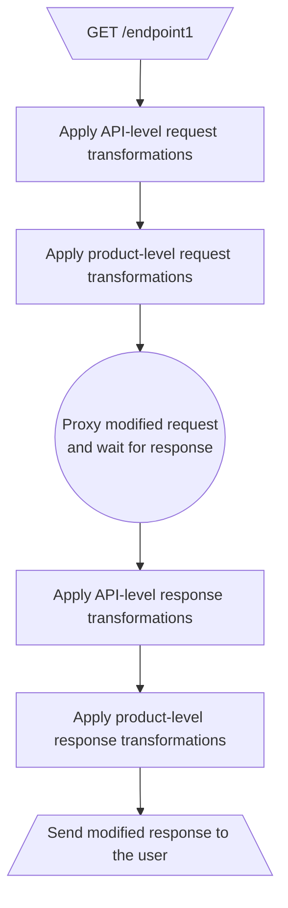

## Overview

Transformations allow you to dynamically modify requests and responses. That includes headers, query string parameters and body.

This section describes API-scoped transformations. If a transformation is defined on an API level, it is applied to any requests/responses to that API or its particular endpoint.

One of the use-cases for transformations is to authenticate Nadles API Gateway in your API backend by an API key. [Learn more](https://docs.nadles.com/api-management/exposing-your-api/#configuring-nadles-api-gateway).

To set up request transformations, navigate to **APIs → choose an API → Transformations**.

<Tip>
  Transformations defined on an API level are always applied first.

  Read about [product-scoped transformations](https://docs.nadles.com/product-modeling/transformations/).
</Tip>

## How it works

