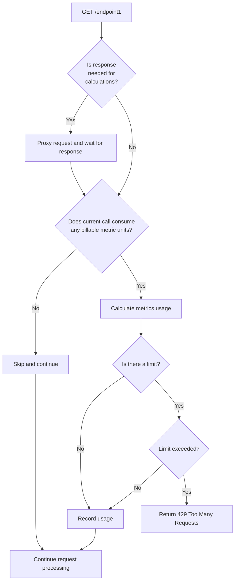

import ExpressionVariablesRequest from '/snippets/expression-variables-request.mdx';
import ExpressionVariablesResponse from '/snippets/expression-variables-response.mdx';


## General

Billable metrics are what you charge your customers for.

Common examples of billable metrics are:

* API calls
* Uploaded/downloaded bytes
* Characters in a text for a Text-to-Speech API
* Internal currency like "coins", "tokens" or "credits"


<Tip>
Try creating products from [templates](/products/create#product-templates) to see different billable metrics configurations in action.
</Tip>


Billable metrics are required in cases when
* You want to charge customers for something other than API calls.
* Your pricing includes pay-as-you-go.
* You'd like to let your customers adjust quantity when they make a purchase.
* You want to configure tiered pricing.
* You want to offer prepaid packages ("buy 1000 tokens, use and top up as needed").
* etc.

For simple scenarios like "Flat monthly fee + rate limit" you can skip billable metric configuration.

<Accordion title="Read more">
Nadles supports flexible pricing models, including prepaid, recurring, usage-based, and any combination of the three.

In case of **prepaid** pricing, your customers buy a certain volume of billable metrics units. 

You can configure your products so that your customers are able to adjust the purchase quantity upon checkout, which is particularly useful in combination with tiered pricing and volume discounts — customers can choose, how many items they buy.

In case of **usage-based** pricing, Nadles automatically tracks the actual usage of billable metrics per customer and charges for the actual usage.

When Nadles API Gateway receives an API call, it calculates, how many billable metric units the current request uses, checks if the total usage exceeds the limit, and if not — continues with request processing.
If the limit is exceeded, the API gateway returns `429 Too Many Requests`.

Nadles API Gateway performs the following steps in order to check metrics limits and record the usage:



</Accordion>

## Add billable metric

* Once you've created a product, navigate to **Billable metrics** in the left menu.

* Click **Add new metric**.

* Fill out the form.

### Metric name

Human-readable name of your billable metric. It will be displayed to your customers on the checkout page and in the user portal.

### Metric label

An identifier that Nadles uses internally to track usage and perform computations when your customers upgrade and downgrade subscriptions.

### Set hard limit

You can set a hard limit on the billable metric that is reset periodically.

This is mostly useful in two cases:

1. To limit usage in free products.

  When you [add an unmetered price](/pricing/create-price#recurring-prices) to the product, you, at the same time, define a usage limit.
  Free products usually have no prices and this setting comes in handy to limit the usage.

2. To cap usage in pay-per-use products.

  Uncapped pay-per-use pricing poses a significant risk to customers: a mistake in application code or malicious activity can lead to unexpected, and potentially enormous, API usage charges.

  The maximum usage limit setting provides a safeguard against excessive API usage that could lead to cost overruns for your customers. Once the limit is exceeded, the API gateway will automatically stop processing requests until the limit resets.
  
  Nadles recognizes that usage needs vary. It allows you to grant customers the ability to adjust [their own API usage limits](#let-customers-adjust-limit).


#### Let customers adjust limit

This field is visible only if **Set hard limit** is enabled.

If enabled, at checkout, customers have the option to adjust their API usage limit before completing their purchase.

### Associated endpoints

Here you select endpoints associated with the billable metric.
By default, each request to one of these endpoints will consume 1 unit. Per-endpoint metric usage can be configured after the billable metric is added to the product.

## Usage configuration

Once the billable metric is added, it's time to configure, how many units each request will consume.

* Navigate to the **Usage configuration** tab.

Here, for each endpoint you can configure two things:

* [Quantity used by a single call](#quantity-used-by-a-single-call)
* [Metric usage condition](#metric-usage-condition)

### Quantity used by a single call

This field defines, how many billable metric units are used by each call to this endpoint.

#### Static usage

By default, the field is set to "1", meaning, each request uses 1 unit.
When Nadles API Gateway receives a request to the endpoint, it records usage of 1 unit.

If you want requests to different endpoints to use a different number of units, set the respective values in the **Quantity used by a single call** field for each endpoint.

This is useful, for instance, in credit-based models when different endpoints cost different number of credits.

#### Dynamic usage

You can also use JavaScript expressions to make Nadles calculate usage for each request on the fly.

Instead of a static number like 1 or 2, you can specify a JavaScript expression that evaluates to an integer representing the usage for the current request based on the request/reponse attributes. Nadles evaluates this expression for each API call and records the result.

Request and response attributes are available as [variables](#expression-variables) that you can use in your JavaScript code.

In complex cases, you can also calculate usage for each call on your side and send it to Nadles along with the response.

See the examples below.

#### Example: send usage to Nadles in response header

<Info>
    Your API backend can tell Nadles directly, how much of the billable metric the current request has used.

    For instance, if you bill for CPU seconds used to process the request and Nadles is unable to infer that value from the request/response on its own, you can calculate it in your API backend for each request and then tell Nadles the actual value it should record by adding a custom header to the response.

    The header name doesn't matter, you can use any valid header name, e.g. `X-Consumed-Cpu-Seconds`.
    
    The expression in this case can be:

    ```js
    response.headers["x-consumed-cpu-seconds"]
    ```

    How it looks in the **Quantity used by a single call** field:

    

    And that's it. Nadles will wait for the response and record the value from the `X-Consumed-Cpu-Seconds` header as usage for the current request.
</Info>

#### Example: variable usage depending on input parameter

<Info>
    The endpoint `GET /prompt/{LLM_MODEL}` allows sending textual prompts to two different AI models: `gpt3` and `gpt4`.

    The API provider would like calls to `gpt4` to consume 2 quota units and calls to `gpt3` to consume 1 quota unit.

    To achieve that, the expression should evaluate to `2` if the path parameter `LLM_MODEL` equals to `gpt4`, `1` otherwise. 
    
    E.g.:

    ```js
    path.params.LLM_MODEL == "gpt4" ? 2 : 1
    ```

    How it looks in the **Quantity used by a single call** field:

    

    Nadles API Gateway will check the value of the path parameter and record the usage of 2 units if `LLM_MODEL` equals `gpt4`, and 1 unit otherwise.
</Info>

#### Example: batch endpoints

<Info>
Let's say, you want to bill for each item in the input array.

The endpoint `POST /process` accepts a JSON array of elements to process
and the request body looks like:

```json
[
    { "data": "ZDU2OWZlODQtODdiZS00YzZjLTk5ODktYTdjNWRjMmQ5NWJj" },
    { "data": "YTQ5NGUyNWMtNDI2NS00MjkzLWJmYWEtNzY5MjQxZjhlYjI1" },
    { "data": "YWZiOTZhNTAtMWE1Zi00Zjg4LWJmMGMtMWVhODQ2ODY3NmVj" }
]
```

Nadles should record usage equal to the number of elements in the input array. The request in this example should use 3 quota units.

The JavaScript expression to parse the request body as JSON and return the number of elements:

```js
JSON.parse(request.body).length
```

In the **Quantity used by a single call** field:


</Info>


### Metric usage condition

By default, Nadles records usage for each request according to the expression in **Quantity used by a single call**, regardless of the response status code.

This field allows you to write a JavaScript expression to control, whether Nadles should record the usage for the current request or not.

The expression must evaluate to a **boolean** value.

Request and response attributes are available as [variables](#expression-variables) that you can use in your JavaScript code.

If the expression evaluates to true, the usage is recorded. If the expression evaluates to false, Nadles doesn't record usage for the current API call.

<Info>
The most common use case for this config option is to make Nadles record quota usage only if response status code is 200.

For that, the `Quota usage condition` expression will be:

```js
response.statusCode == 200
```

In the **Metric usage condition** field:


Configured this way, Nadles will record quota usage only if the API returned a response with HTTP status code `200 OK`.
</Info>

### Expression variables

You can use the following variables in **Quantity used by a single call** and **Metric usage condition** expressions.

#### Request

<ExpressionVariablesRequest />

#### Response

<ExpressionVariablesResponse />
