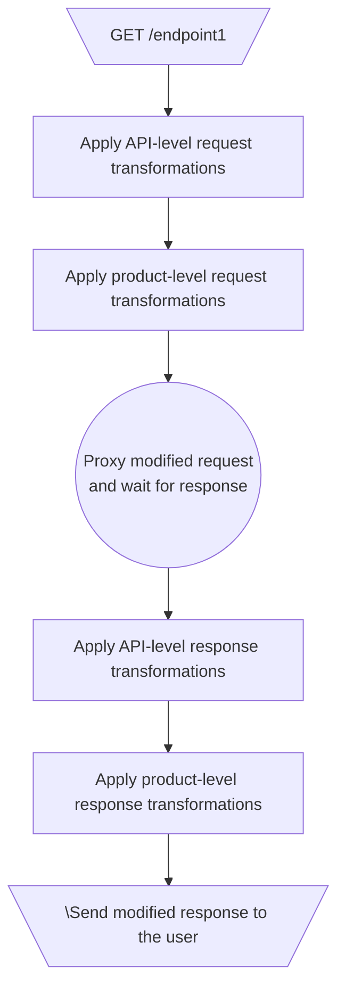

```mermaid
graph TD
  input[\"GET /endpoint1"/]
  
  apply_api_req_tfs[Apply API-level request transformations]
  apply_product_req_tfs[Apply product-level request transformations]
  
  proxy_and_wait(("Proxy modified request
  and wait for response"))
  
  apply_api_resp_tfs[Apply API-level response transformations]
  apply_product_resp_tfs[Apply product-level response transformations]
  
  send_response[\\Send modified response to the user/]
  
  input --> apply_api_req_tfs
  apply_api_req_tfs --> apply_product_req_tfs
  apply_product_req_tfs --> proxy_and_wait
  proxy_and_wait --> apply_api_resp_tfs
  apply_api_resp_tfs --> apply_product_resp_tfs
  apply_product_resp_tfs --> send_response
```